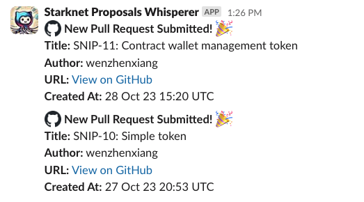

# Starknet Proposals Whisperer

- [Starknet Proposals Whisperer](#starknet-proposals-whisperer)
  - [Project Description](#project-description)
  - [What the Code Does](#what-the-code-does)
  - [AWS Lambda Deployment](#aws-lambda-deployment)
  - [How to Update the Code and Trigger CI/CD](#how-to-update-the-code-and-trigger-cicd)

## Project Description

The Starknet Proposals Whisperer is a Slack bot designed to keep your team updated on new Starknet Proposals. It listens for new pull requests in a specified GitHub repository and sends notifications to a Slack channel. This bot aims to streamline the process of keeping track of new proposals, ensuring that your team is always in the loop.

## What the Code Does

The core logic of the application is written in Go and is contained in the main.go file. The application uses AWS Lambda to run the code. Here's a breakdown of what the code does:

- Initializes environment variables for Slack Webhook URL, GitHub repository owner and name, and a threshold for days.
- Listens for new pull requests in the specified GitHub repository.
- Sends a Slack notification if a new pull request is detected within the threshold days.

## AWS Lambda Deployment

The code is deployed to AWS Lambda, Angkor-Production account.

> The binary is built inside an Amazon Linux 2 Docker container to ensure compatibility with the AWS Lambda environment.

- AWS Region: us-east-2
- Runtime: Go 1.x
- Handler: main
- Function Name: starknet-proposals-whisperer
- Environment Variables: 
    - `SLACK_WEBHOOK_URL`: The Slack Webhook URL for the channel you want to send notifications to.
    - `GITHUB_REPO_OWNER`: The owner of the GitHub repository you want to monitor.
    - `GITHUB_REPO_NAME`: The name of the GitHub repository you want to monitor.
    - `THRESHOLD_DAYS`: The number of past days you want to monitor for new pull requests.

## How to Update the Code and Trigger CI/CD

The repository uses GitHub Actions for Continuous Integration and Continuous Deployment. The workflow is defined in the `.github/workflows/deploy.yml` file. To update the code and trigger the CI/CD pipeline, follow these steps:

1. Make your code changes locally.
1. Commit and push the changes to the main branch.
1. GitHub Actions will automatically build and deploy the code to AWS Lambda.